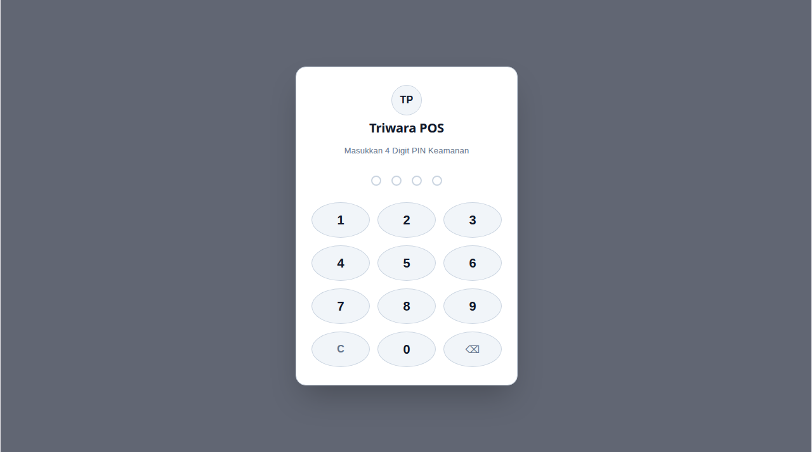
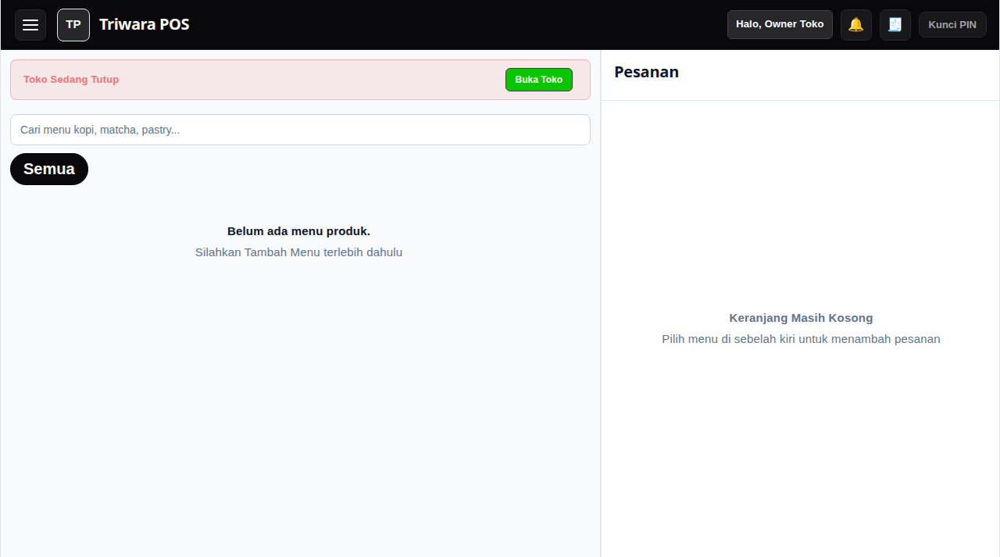
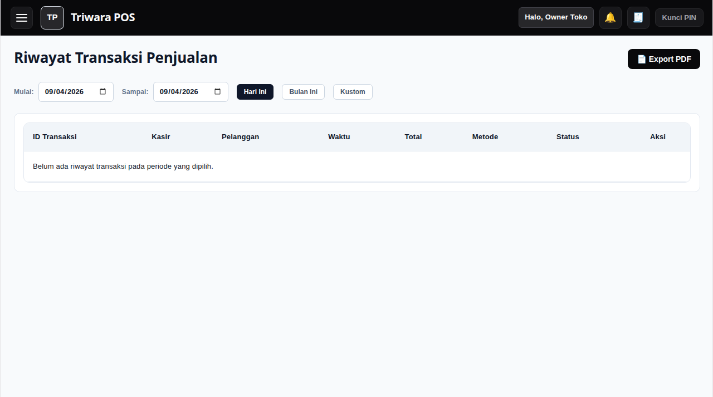
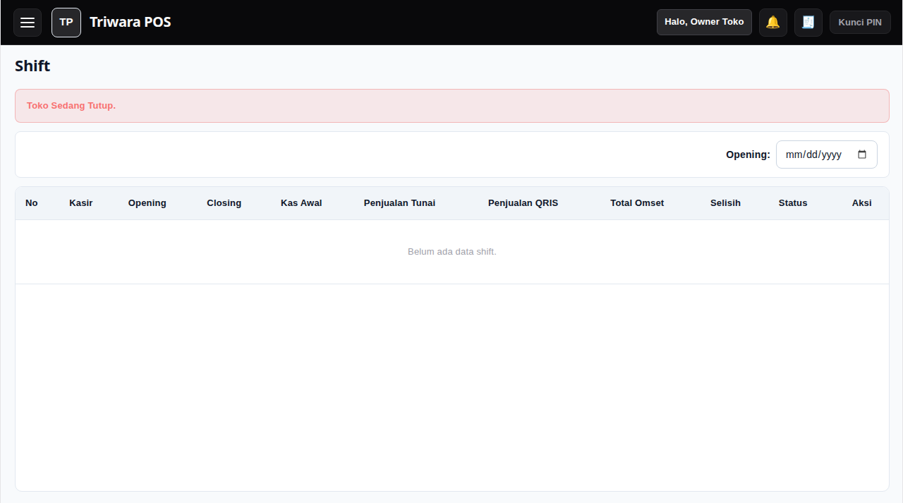
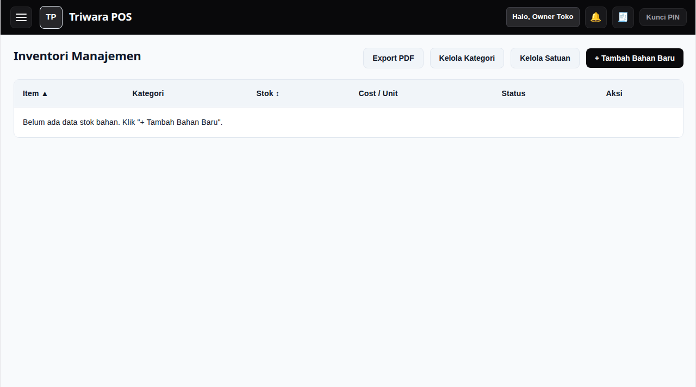
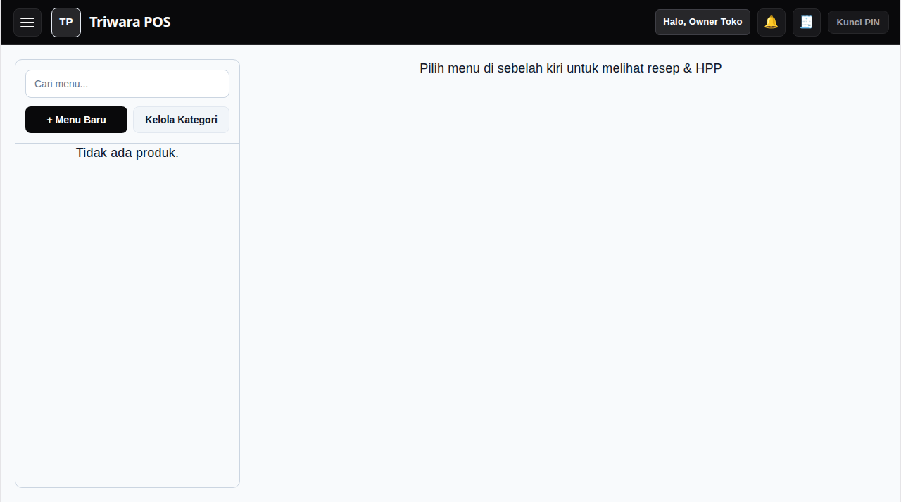
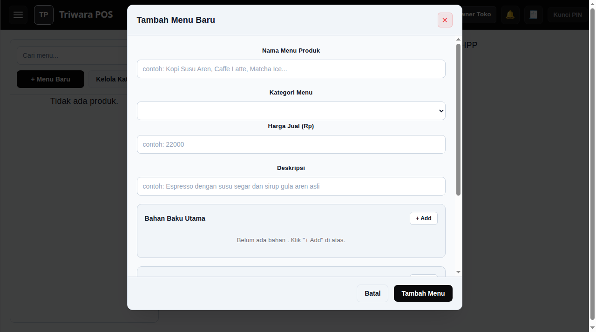
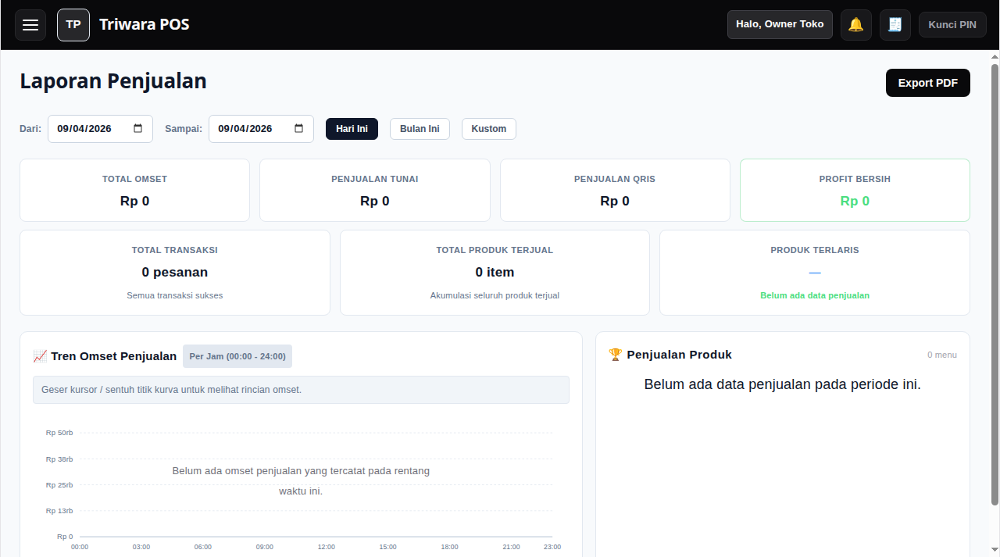
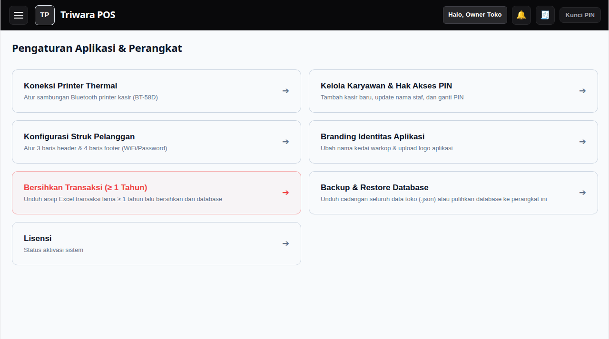
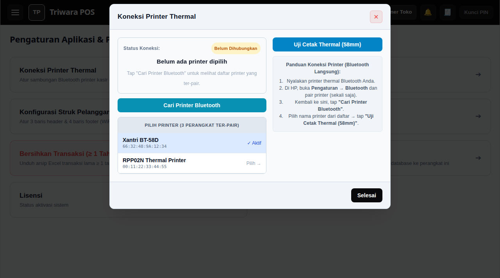

# ☕ Buku Panduan Penggunaan — Triwara POS
> **Sistem Kasir & Manajemen F&B Modern (Offline-First, Real-Time HPP, & Bluetooth Thermal Printing)**

---

Selamat datang di **Buku Panduan Penggunaan Triwara POS**. Dokumen ini disusun khusus sebagai panduan operasional praktis bagi **Pemilik Toko (Owner)**, **Manajer Kedai**, dan **Petugas Kasir/Barista** dalam menjalankan operasional harian kedai secara mudah, cepat, dan akurat tanpa memerlukan keahlian teknis.

---

## 📑 Daftar Isi

1. [Bab 1: Keamanan & Masuk Menggunakan PIN](#1-keamanan--masuk-menggunakan-pin)
2. [Bab 2: Membuka Shift Kasir (Modal Awal Toko)](#2-membuka-shift-kasir-modal-awal-toko)
3. [Bab 3: Layar Utama Kasir (POS) & Pemesanan](#3-layar-utama-kasir-pos--pemesanan)
4. [Bab 4: Pilihan Varian Menu & Topping Tambahan](#4-pilihan-varian-menu--topping-tambahan)
5. [Bab 5: Pembayaran & Cetak Struk](#5-pembayaran--cetak-struk)
6. [Bab 6: Fitur Pesanan Gantung (Held Orders)](#6-fitur-pesanan-gantung-held-orders)
7. [Bab 7: Riwayat Transaksi & Pembatalan (Void)](#7-riwayat-transaksi--pembatalan-void)
8. [Bab 8: Tutup Shift Kasir & Rekap Kas Fisik](#8-tutup-shift-kasir--rekap-kas-fisik)
9. [Bab 9: Inventori & Stok Bahan Baku](#9-inventori--stok-bahan-baku)
10. [Bab 10: Katalog Menu, Resep & Perhitungan HPP Otomatis](#10-katalog-menu-resep--perhitungan-hpp-otomatis)
11. [Bab 11: Laporan Penjualan & Pembukuan](#11-laporan-penjualan--pembukuan)
12. [Bab 12: Pengaturan Toko & Koneksi Printer Thermal Bluetooth](#12-pengaturan-toko--koneksi-printer-thermal-bluetooth)
13. [Bab 13: Kelola Karyawan, Backup Data & Lisensi](#13-kelola-karyawan-backup-data--lisensi)
14. [Bab 14: Tanya Jawab & Solusi Kendala (FAQ)](#14-tanya-jawab--solusi-kendala-faq)

---

## 1. Keamanan & Masuk Menggunakan PIN

Aplikasi Triwara POS dilindungi oleh sistem keamanan PIN 4 digit untuk memastikan setiap transaksi tercatat atas nama kasir yang bertugas dan menu pengaturan penting hanya dapat diakses oleh Owner.

### 🔹 Tingkatan Hak Akses (Role)
* **Owner (Pemilik Toko)**: Memiliki akses penuh ke seluruh fitur (Pengaturan Toko, Katalog Resep & HPP, Laporan Keuangan, Kelola Karyawan, Void Transaksi, dan Backup Data).
* **Kasir / Barista**: Memiliki akses ke Layar Kasir (POS), Riwayat Transaksi Shift Berjalan, Buka/Tutup Shift, dan Log Aktivitas.

### 🔹 Cara Masuk:
1. Tekan tombol angka **4 digit PIN** Anda pada layar numpad.
2. Jika PIN benar, aplikasi akan otomatis terbuka dan menampilkan identitas staf/kasir di pojok kanan atas.
3. Gunakan **4-Digit PIN Keamanan** yang telah didaftarkan oleh Pemilik Toko.

---

## 2. Membuka Shift Kasir (Modal Awal Toko)

Sebelum mulai melayani transaksi pelanggan pertama, kasir wajib membuka shift dengan memasukkan uang modal kembalian.

### 🔹 Langkah Membuka Shift:
1. Setelah login kasir, aplikasi akan menampilkan pop-up **"Buka Toko / Shift"**.
2. Masukkan jumlah **Uang Kas Awal** di laci kasir (misalnya Rp 100.000). Anda juga dapat menggunakan tombol cepat (*Rp 50.000, Rp 100.000, Rp 200.000*).
3. Klik tombol **"Buka Shift Sekarang"**.
4. Kasir siap menerima pesanan!

---

## 3. Layar Utama Kasir (POS) & Pemesanan

Layar kasir dirancang dengan tata letak bersih dan responsif (*Split Screen 60% Menu / 40% Keranjang*).

### 🔹 Fitur di Layar Kasir:
* **Pencarian Cepat Menu**: Ketik nama menu pada kotak pencarian di bagian atas.
* **Filter Kategori**: Geser tab kategori (*Semua, Kopi, Non-Kopi, Makanan, Camilan*) untuk menyaring menu dengan cepat.
* **Daftar Menu Produk**: Menampilkan nama menu, harga jual, dan status ketersediaan bahan resep.
* **Keranjang Pesanan (Sebelah Kanan)**: Menampilkan rincian pesanan yang sedang dipilih, jumlah (*Qty*), subtotal harga, serta tombol penyesuaian.

---

## 4. Pilihan Varian Menu & Topping Tambahan

Ketika memilih menu minuman atau makanan, Anda dapat menyesuaikan varian pesanan sesuai permintaan pelanggan.

### 🔹 Pengaturan Varian:
1. **Tipe Pesanan**: Pilih **Dine-In** (Makan/Minum di Tempat) atau **Takeaway** (Bungkus Bawa Pulang). *Kemasan takeaway akan otomatis memotong stok kemasan di sistem.*
2. **Suhu Minuman**: Pilih **Ice** (Dingin) atau **Hot** (Panas).
3. **Tingkat Gula (Sugar Level)**: Pilih **Normal**, **Less Sugar**, atau **No Sugar**.
4. **Additional / Topping Tambahan**: Centang opsi topping yang diinginkan (misalnya *Extra Shot, Jelly, Sirup Aren*). Harga tambahan akan otomatis ditambahkan ke total pesanan.
5. **Catatan Khusus**: Tulis catatan pesanan khusus dari pelanggan (misalnya *"Gelas dipisah"*).
6. Klik **"Tambah ke Keranjang"**.

---

## 5. Pembayaran & Cetak Struk

Setelah semua pesanan pelanggan masuk ke keranjang, lanjutkan ke proses pembayaran.

### 🔹 Pilihan Metode Pembayaran:
* **Tunai (Cash)**:
  - Masukkan jumlah uang yang diterima dari pelanggan, atau klik tombol nominal cepat (*Uang Pas, 50.000, 100.000*).
  - Sistem akan langsung menghitung **Uang Kembalian** secara otomatis.
* **QRIS / Non-Tunai**:
  - Tampilkan QRIS statis toko Anda ke pelanggan.
  - Setelah pelanggan berhasil membayar, pilih opsi QRIS.

### 🔹 Menyelesaikan Transaksi & Cetak Struk:
1. Klik tombol **"Bayar & Cetak Struk"** atau **"Selesaikan Pembayaran"**.
2. Struk pesanan format thermal 58mm akan otomatis terkirim langsung ke printer Bluetooth kasir.

---

## 6. Fitur Pesanan Gantung (Held Orders)

Jika pelanggan sedang memesan namun ingin menambah pesanan lain atau antrean di belakangnya ingin dilayani terlebih dahulu, kasir dapat menahan (*Hold*) pesanan tersebut.

### 🔹 Cara Menggunakan:
1. Di panel keranjang kasir, klik tombol **"Tahan Pesanan"** *(Hold)*.
2. Masukkan nama/nomor meja pelanggan (misalnya *"Meja 04"* atau *"Mas Dimas"*).
3. Keranjang akan bersih kembali untuk melayani pelanggan berikutnya.
4. Untuk membuka kembali pesanan yang ditahan: Klik tombol **"Pesanan Gantung"** di pojok kanan atas keranjang, lalu pilih pesanan yang ingin dilanjutkan untuk pembayaran.

---

## 7. Riwayat Transaksi & Pembatalan (Void)

Menu Riwayat Transaksi memungkinkan kasir dan owner melihat semua nota penjualan yang terjadi pada hari ini maupun tanggal sebelumnya.

### 🔹 Kemampuan Riwayat Transaksi:
* **Filter Tanggal & Status**: Cari nota berdasarkan tanggal atau nomor struk.
* **Cetak Ulang Struk (Reprint)**: Jika kertas printer habis atau pelanggan meminta nota baru.
* **Ekspor Riwayat PDF**: Unduh seluruh daftar transaksi pada periode yang dipilih ke format PDF resmi.
* **Pembatalan Transaksi (Void)**:
  - Dapat dilakukan oleh Kasir maupun Owner jika terjadi kesalahan input atau pembatalan pesanan.
  - Klik tombol **"🚫 Void"** pada baris transaksi yang ingin dibatalkan.
  - Masukkan alasan pembatalan (misalnya *"Salah input menu"*).
  - Sistem akan otomatis membatalkan nota dan mengembalikan seluruh stok bahan baku yang terpakai ke inventori!

---

## 8. Tutup Shift Kasir & Rekap Kas Fisik

Di akhir jam kerja kasir, petugas wajib melakukan penutupan shift untuk merekap penerimaan uang tunai dan non-tunai.

### 🔹 Langkah Tutup Shift:
1. Buka menu samping (☰) → Pilih **"Shift"** → Klik **"Tutup Shift"**.
2. Sistem akan menampilkan rincian:
   - Kas Awal Modal
   - Total Penjualan Tunai
   - Total Penjualan QRIS
   - Pengeluaran Kas Operasional Toko (jika ada)
   - **Estimasi Total Uang Kas di Laci**
3. Masukkan jumlah **Uang Kas Fisik Nyata** yang ada di laci kasir setelah dihitung manual.
4. Sistem akan otomatis menampilkan status:
   - **Pas (Sesuai)**
   - **Surplus (Uang Lebih)**
   - **Minus (Uang Kurang)**
5. Klik **"Konfirmasi Tutup Shift"** dan cetak struk rekapitulasi shift.

---

## 9. Inventori & Stok Bahan Baku

Menu Inventori digunakan untuk memantau stok bahan mentah (biji kopi, susu, sirup, bubuk matcha, dsb.) dan bahan kemasan (paper cup, tutup cup, sedotan).

### 🔹 Fitur Inventori:
* **Pencatatan Bahan & Satuan**: Kelola bahan dalam satuan yang fleksibel (*Gram, Mililiter, Pcs, Lembar*).
* **Batas Alert Stok Menipis**: Memberikan peringatan visual berwarna kuning/merah jika sisa stok sudah di bawah batas minimum aman.
* **Restock / Tambah Stok**: Tambahkan stok masuk saat ada pengiriman barang dari supplier beserta harga belinya.
* **Log Mutasi Stok**: Melacak setiap gram/ml bahan yang keluar (karena penjualan kasir) maupun yang masuk.

---

## 10. Katalog Menu, Resep & Perhitungan HPP Otomatis

Salah satu keunggulan utama Triwara POS adalah **Perhitungan HPP (Harga Pokok Penjualan) Resep Otomatis**. Anda tidak perlu menghitung biaya produksi per cangkir kopi secara manual!

### 🔹 Cara Membuat & Mengatur Resep Menu:
1. Buka menu (☰) → **Produk & Stok** → **Katalog Menu & Resep**.
2. Klik tombol **"+ Menu Baru"** atau pilih menu yang ada lalu klik **"Edit Menu"**.
3. Masukkan **Nama Menu**, **Kategori**, dan **Harga Jual**.
4. **Bagian Bahan Baku Utama**:
   - Klik **"+ Add"** → Pilih bahan baku dan takarannya (misal: *Espresso 30 ml, Fresh Milk 120 ml, Gula Aren 20 ml*).
5. **Bagian Kemasan Takeaway**:
   - Tambahkan bahan kemasan (misal: *Cup 16oz 1 pcs, Lid Cup 1 pcs, Sedotan 1 pcs*).
6. **Bagian Additional / Topping**:
   - Atur pilihan topping opsional beserta harga jual tambahan dan bahan yang terpotong.
7. **Perhitungan HPP & Margin**:
   - Sistem akan otomatis menjumlahkan harga beli bahan baku dan menampilkan **HPP Dine-In**, **HPP Takeaway**, serta **Estimasi Margin Keuntungan Bersih** per porsi menu secara real-time!
8. Klik **"Simpan Menu"**.

---

## 11. Laporan Penjualan & Pembukuan

Owner dapat melihat performa penjualan kedai secara transparan kapan saja tanpa perlu menyusun laporan manual.

### 🔹 Informasi Laporan:
* **Grafik Tren Omset**: Grafik visual pendapatan harian, mingguan, dan bulanan.
* **Ringkasan Finansial**: Total Omset Kotor, Estimasi Total HPP Modal, dan Laba Kotor (*Gross Profit*).
* **Produk Terlaris (*Best Seller*)**: Mengetahui menu favorit pelanggan dan menu yang kurang laku.
* **Rincian Pembayaran**: Persentase transaksi Tunai vs QRIS.
* **Ekspor Dokumen PDF**: Unduh laporan lengkap penjualan dan ringkasan keuangan ke format PDF resmi siap cetak atau dibagikan.

---

## 12. Pengaturan Toko & Koneksi Printer Thermal Bluetooth

Triwara POS mendukung pencetakan langsung via Bluetooth Serial (ESC/POS) ke berbagai printer thermal 58mm tanpa memerlukan aplikasi pihak ketiga seperti RawBT.

### 🔹 Cara Menghubungkan Printer Bluetooth:
1. **Nyalakan Printer Thermal Bluetooth** Anda.
2. Di perangkat HP atau Tablet kasir, buka **Pengaturan Android → Bluetooth**, cari printer thermal Anda, dan lakukan **Pairing** (PIN pairing biasanya `0000` atau `1234`).
3. Kembali ke aplikasi Triwara POS → Buka menu samping (☰) → **Pengaturan Toko**.
4. Pilih kartu **"Koneksi Printer Thermal"**.
5. Klik tombol **"Cari Printer Bluetooth"**.
6. Pilih nama printer Anda dari daftar perangkat yang muncul (misalnya *Xantri BT-58D* atau *RPP02N*).
7. Klik tombol **"Uji Cetak Thermal (58mm)"** untuk memastikan struk keluar dengan rapi dan tidak terpotong.
8. Klik **"Selesai"**.

---

## 13. Kelola Karyawan, Backup Data & Lisensi

Menu ini dikhususkan bagi Pemilik Toko (Owner) untuk menjaga keamanan dan kesinambungan data usaha.

### 🔹 1. Kelola Karyawan & Hak Akses:
* Tambah akun kasir baru dengan nama dan PIN 4 digit mandiri.
* Mengubah nama atau menonaktifkan akun staf yang sudah tidak bekerja.

### 🔹 2. Backup & Restore Database:
* **Cadangkan Data (.json)**: Unduh seluruh database transaksi, produk, resep, dan inventori ke penyimpanan perangkat. Lakukan backup secara berkala (misal 1 minggu sekali).
* **Pulihkan Data**: Mengembalikan seluruh data toko saat berganti perangkat HP/Tablet baru.
* **Bersihkan Data Lama**: Mengarsipkan data transaksi lama di atas 1 tahun agar aplikasi tetap ringan dan responsif.

### 🔹 3. Identitas & Branding Toko:
* Unggah logo warkop/kedai untuk tampil di bagian header struk cetak dan layar login aplikasi.
* Atur alamat toko, nomor WhatsApp, dan pesan penutup pada struk pelanggan.

### 🔹 4. Lisensi Perangkat:
* Perangkat diaktivasi menggunakan Kunci Lisensi resmi dari pengembang yang tersimpan permanen di perangkat tanpa perlu diatur ulang.

---

## 14. Tanya Jawab & Solusi Kendala (FAQ)

#### ❓ Printer tidak mencetak struk saat transaksi?
> **Solusi**: Pastikan Bluetooth HP/Tablet menyala, printer dalam keadaan ON dan kertas thermal tidak terpasang terbalik. Buka menu *Pengaturan Toko → Koneksi Printer Thermal* dan pastikan status printer bertanda **"✓ Aktif"**.

#### ❓ Lupa PIN Kasir atau Supervisor?
> **Solusi**: Masuk menggunakan akun **Owner (PIN Pemilik)**. Buka menu *Pengaturan Toko → Kelola Karyawan*, lalu pilih akun kasir yang bersangkutan untuk mengganti PIN barunya.

#### ❓ Apakah aplikasi tetap bisa digunakan jika tidak ada koneksi internet / WiFi mati?
> **Solusi**: **Bisa 100%!** Triwara POS beroperasi secara mandiri (*Offline-First*). Seluruh transaksi, stok, resep, dan laporan tersimpan aman di memori lokal perangkat Anda.

---

*Dokumentasi Resmi Triwara POS — Siap Mendukung Suksesnya Usaha Kedai & Warkop Anda.* 🚀
